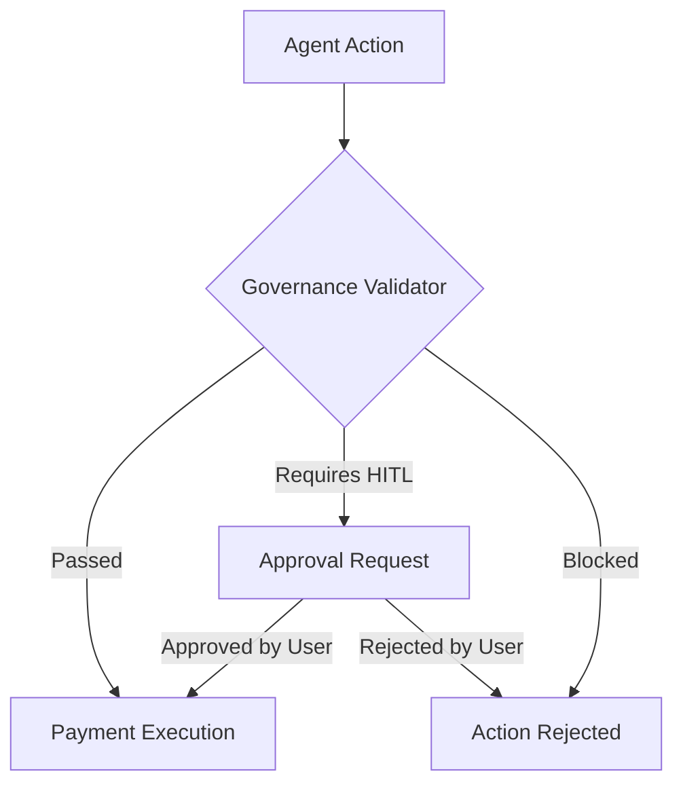
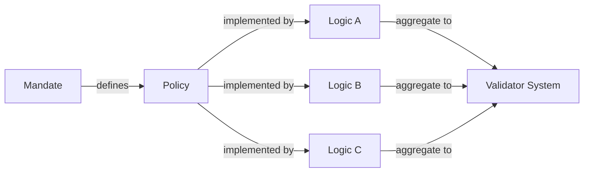

# Agentic Governance & Transaction Mandates Specification

This document describes the architecture of the Agentic Governance system in the context of autonomous payments, specifically addressing **Transaction Mandates** and **Financial Services** regulations.

## 1. Introduction to Agentic Governance
Agentic Governance refers to the programmable safety boundaries designed to oversee the autonomous decision-making of AI agents. In the financial sector, these boundaries act as an "immutable conscience" for agents, ensuring they operate within predefined risk tolerances, regulatory limits, and security frameworks. Unlike traditional hardcoded logic, agentic governance is dynamic, context-aware, and designed to interpret the complex "reasoning" provided by autonomous models before any capital is moved.

### 1.1 Core Description & Pillars
- **Reasoning Analysis**: Evaluates the *why* behind an agent's request, checking for semantic alignment between the stated goal and the financial action.
- **Temporal Enforcement**: Governs the *velocity* of actions (e.g., cooldowns) to prevent rapid-fire errors or automated exploits.
- **Risk Mitigation Disclosure**: Every governance rule is mapped to a specific risk it mitigates, ensuring transparency for regulators and users alike.

## 2. Introduction to Transaction Mandates
**Transaction Mandates** are standardized policy requirements used to protect users from systemic risks such as runaway spending, merchant impersonation, and phishing. In a financial context, these mandates are specifically tailored to align with regulatory guidelines (e.g., MAS User Protection Guidelines) and the unique instantaneous nature of modern push-payment ecosystems (e.g., FAST/PayNow).

### 2.1 Core Description & Pillars
- **Standardized Risk Taxonomy**: Categorizes financial risks into Authorization, Spending, Category, and Temporal domains.
- **Cross-Agent Trust Framework**: Defines how agents verify the identity and reputation of counterparts before initiating payments.
- **Regulatory-to-Code Mapping**: Translates high-level legal requirements into executable mandates.

## 3. Executive Summary
The Agentic Governance system provides a safety layer between autonomous agents and financial payment rails. It ensures that agentic actions are compliant with regulatory frameworks, protected against security threats (phishing, scams), and subject to human-in-the-loop (HITL) oversight for high-risk operations.

## 4. Architecture Overview

The system follows a tiered validation architecture:



### 4.1 Core Components
- **Constraint Model**: Defines granular rules (Mandates) with associated risk metrics.
- **Validation Engine**: Evaluates transactions against the Constraint Model.
- **State Store**: Maintains transaction history for rate limiting and merchant verification.
- **HITL Integration**: Cryptographic/Manual approval flow for overrides.

## 5. Mandates vs. Governance Logic: Differentiation & Relation

The framework distinguishes between the **Mandate** (the Policy) and the **Governance Logic** (the Enforcement).

### 5.1 Key Differences

| Feature | Transaction Mandate (Policy) | Governance Logic (Enforcement) |
| :--- | :--- | :--- |
| **Nature** | Abstract requirement or regulatory rule. | Concrete software check or logic gate. |
| **Purpose** | To define *what* risk is being mitigated. | To define *how* the mitigation is applied. |
| **Origin** | Compliance, Legal, or Business Risk. | Engineering, Architecture, and Validator code. |
| **Example** | "Scams must be prevented for new vendors." | `requireVerificationForNewMerchants: true` |

### 5.2 The Relationship (One-to-Many)

A single **Mandate** can be realized by multiple **Governance Logic** checks working in concert.

**Relation Example: The "Phishing Defense" Mandate**
- **Mandate**: Ensure secure vendor authorization.
- **Contributing Governance Checks**:
    1. **Merchant Verification**: Checks if the ID is previously known.
    2. **Transaction Cooldown**: Prevents rapid-fire drainage if verification is bypassed.
    3. **Payment Method Filter**: Restricts to secure local channels.



## 6. Financial Transaction Mandates

Standardized mandates specifically designed for the financial ecosystem.

### 6.1 Mandate Categories

| Category | Description | ID |
| :--- | :--- | :--- |
| **Authorization** | Verification of merchants and payment channels. | `gov-auth-01` |
| **Spending Limit** | Per-transaction and aggregate daily limits. | `gov-limit-01` |
| **Category Restriction** | Blocking high-risk or illegal merchant categories. | `gov-cat-01` |
| **Cooldown** | Temporal constraints between transactions. | `gov-time-01` |

### 6.2 Specific Mandates (Example Context)

#### [high] New Merchant Verification
- **Regulatory Hook**: Anti-Scam / AML Requirements
- **Rule**: If a merchant ID is not in the agent's "Trust List" or transaction history, the payment **must** require manual user confirmation.
- **Risk Mitigated**: Prevents "drainer" scams where an agent is redirected to a malicious merchant.

#### [medium] Confirmation Threshold
- **Rule**: Any transaction above a user-defined threshold (default: $50) requires explicit confirmation, regardless of other status.
- **Security**: Mitigates large unauthorized transfers.

#### [high] Blocked Categories
- **In-Scope**: Gambling, Unregulated Crypto, Offshore Investment, Job Scams.
- **Regulation**: Compliance with financial acts and regulatory lists.
- **Enforcement**: Immediate rejection (Non-Approvalable).

## 7. Implementation Details

### 7.1 The Constraint Model (`MandateConstraint`)
Each constraint is defined by:
- **value**: Internal parameter (e.g., $ amount).
- **riskMitigated**: Human-readable explanation of the defense.
- **severity**: Low, Medium, High (determines UI color and approval flow).
- **category**: Categorization based on the governance protocol.

### 7.2 The Validation Flow
1. **Context Extraction**: The agent's proposed transaction is mapped to a standard interface.
2. **History Lookup**: Wallet history is checked for merchant recurrence and spending aggregates.
3. **Multi-Pass Validation**:
    - **Pass 1**: Blocklist check (Strict Rejection).
    - **Pass 2**: New Merchant & Limits check (HITL Requirement).
    - **Pass 3**: Category & Cooldown check.
4. **Result Generation**: Returns `allowed`, `requiresApproval`, and a `reason`.

## 8. Agent-Specific Governance (Autonomous Safety)

Beyond standard financial mandates, specific governance logic is required to oversee behavioral models acting as agents.

### 8.1 Reasoning Validation
- **Requirement**: Agents must provide a structured `reasoning` string for every proposed action.
- **Verification**: The validator ensures that the reasoning is logically consistent with the transaction intent.

### 8.2 Hallucination Detection
- **Merchant Cross-Referencing**: Proactively validates that the proposed merchant details are consistent with real-world or historical data.
- **Product Verification**: Prevents "ghost transactions" for non-existent or mispriced items.

### 8.3 Security & Injection Defense
- **Intent Boundary**: Monitors for "intent shifting" where agent commands are manipulated via malicious input.
- **Strict Payload Enforcement**: The validator only accepts standardized data formats, discarding narrative or non-executable code.

### 8.4 Logic Consensus (Multi-Pass Evaluation)
- **Sanity Check**: For high-value transactions, a secondary verifier model can review the primary agent's decision before reaching the human level.

## 9. Security Posture

### 9.1 Phishing & Scam Defense
- **Temporal Cooldown**: Prevents rapid-fire "draining" attacks.
- **Merchant Reputation**: Flags suspicious IDs before payment is initiated.

### 9.2 Regulatory Alignment
- **Compliance**: Aligns with guidelines for user protection and technology risk management.
- **Safety**: Adds a programmable security layer on top of near-instant payment rails.

## 10. Data Model (Conceptual)

The governance data model is platform-agnostic, defining core attributes required across different environments.

### 10.1 Mandate Definition

| Attribute | Description | Example |
| :--- | :--- | :--- |
| **Constraint Value** | The threshold or parameter for the rule. | `$50.00`, `['Gambling']` |
| **Risk Disclosure** | Statement of the vector being mitigated. | "Prevents drainer scams" |
| **Severity Level** | The priority and impact. | `High`, `Medium`, `Low` |
| **Category** | The functional domain. | `Authorization`, `Spending` |
| **Description** | Human-readable explanation. | "Requires verification for new merchants" |

### 10.2 Governance Framework
Key components include:
- **Merchant Verification**: Boolean flag and trust thresholds.
- **Transaction Limits**: Numerical bounds for individual/daily aggregates.
- **Velocity Controls**: Rate-limiting parameters.
- **Categorical Filters**: Lists of restricted identifiers.
- **Channel Controls**: Validated payment methods.

### 10.3 Verification Output (Result Matrix)
1. **Permission Status**: (Binary) Compliant or Non-compliant.
2. **Intervention Requirement**: Is HITL approval needed?
3. **Reasoning Detail**: Explanation for triggered mandates.
4. **Impact Score**: Risk level of the override.

### 10.4 HITL Request
- **Metadata**: Amount, Merchant, and Channel.
- **Logic Trace**: Visual or textual decision path.
- **Context**: Risk levels and mitigation strategies.

## 11. Implementation Examples (TypeScript)

Concrete definitions illustrating a reference implementation.

### 11.1 Configuration

```typescript
type Severity = 'low' | 'medium' | 'high';
type GovCategory = 'authorization' | 'spending_limit' | 'category_restriction' | 'cooldown';

interface MandateConstraint<T = any> {
  value: T;
  riskMitigated: string;
  severity: Severity;
  category: GovCategory;
  description: string;
}

interface GovernanceSettings {
  requireVerificationForNewMerchants: MandateConstraint<boolean>;
  confirmationThreshold: MandateConstraint<number>;
  maxTransactionsPerHour: MandateConstraint<number>;
  transactionCooldownSeconds: MandateConstraint<number>;
  blockedCategories: MandateConstraint<string[]>;
  allowedPaymentMethods: MandateConstraint<string[]>;
}
```

### 11.2 Result and Request

```typescript
interface ValidationResult {
  allowed: boolean;
  requiresApproval: boolean;
  reason?: string;
  mitigationRisk?: string;
  severity?: Severity;
}

interface ApprovalRequest {
  id: string;
  agentId: string;
  amount: number;
  description: string;
  reasoning: string;
  riskLevel: number; // 1-5 scale
  createdAt: number;
}
```

## 12. Practical Usage Scenarios

Interaction between the Agent, the Validator, and the Mandates.

### Scenario 1: Routine Multi-Vendor Procurement (Autonomous)
* **Action**: Agent identifies a missing item and finds it on a trusted marketplace for $35.00.
* **Validation**: Passed across category, amount, merchant, and channel checks.
* **Outcome**: **Autonomous Execution**.

### Scenario 2: High-Value Asset Purchase (HITL)
* **Action**: Agent proposes a purchase exceeding the autonomous threshold.
* **Validation**: Triggered amount mandate (Medium/High severity).
* **Outcome**: **Human-in-the-loop required**. User reviews and approves.

### Scenario 3: Potential Scam/Suspicious Activity (Blocked)
* **Action**: Agent attempts payment to a new, unverified merchant via an unusual channel.
* **Validation**: Triggered multiple mandates (Authorization, Channel, Reasoning consistency).
* **Outcome**: **Immediate Intervention**. Warning displayed, agent paused for safety.

---
*Revision: 1.0 (Feb 2026)*
*Ref: Generic Governance Framework v0.1*
